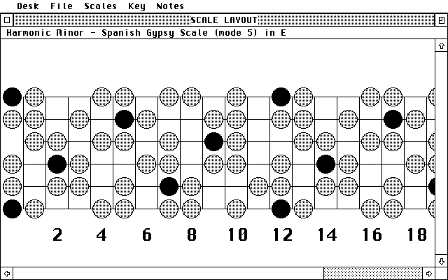
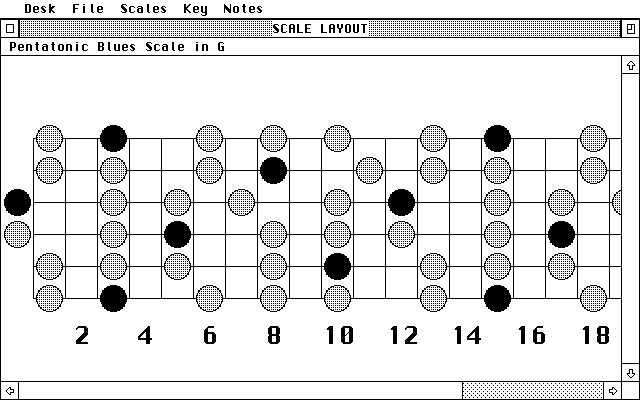
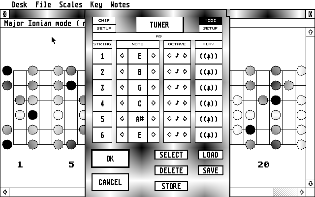
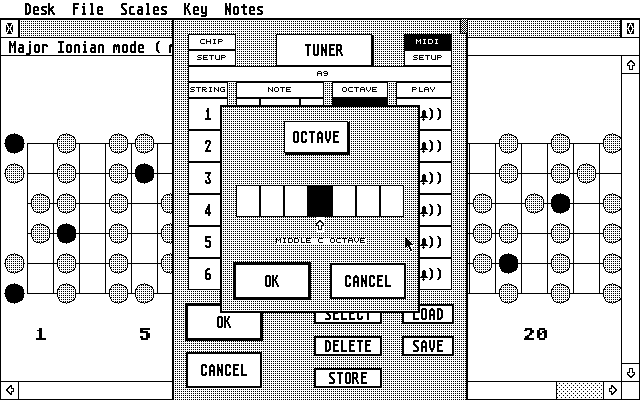
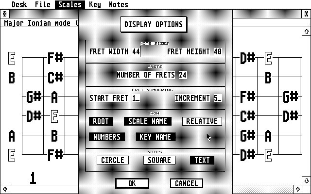
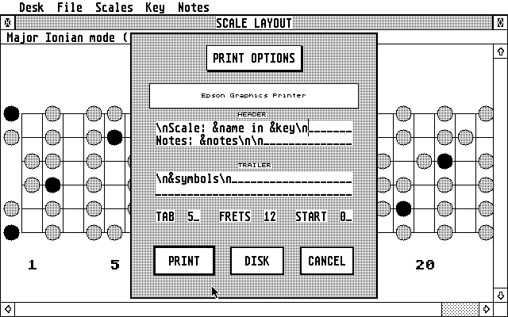
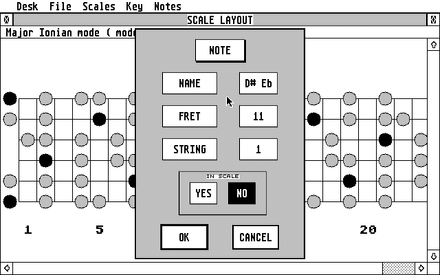
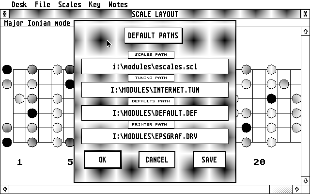
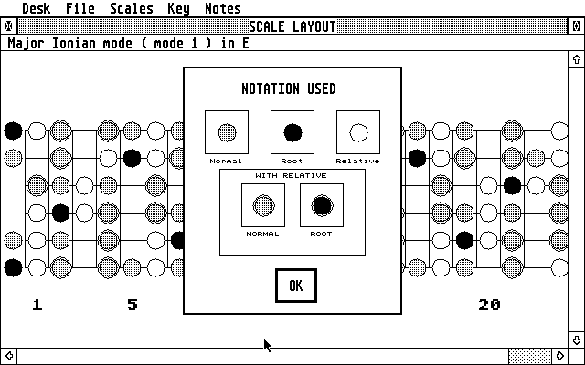

# Atari ST Guitar Reference Website

This document consolidates the original top-level HTML pages from original html and user manual into one Markdown file while preserving as much content as possible.

---

## The Guitar Reference

### A GEM Guitar Tool for the Atari ST.

The ST being the world's cheapest music computer has rather ignored the guitarist. There have been a few tools aimed at guitarist but these are either too expensive or for one reason or another just didn't turn me on. So I wrote one that wasn't expensive but got my fretboard juices flowing.

The tool acts as a Scale Reference, and Tuning reference.

## Scale Reference

**Features**:

- 57 scales in the database
- new scales can be added
- scales can be edited
- scales can be displayed on screen at a variety of zoom levels
- scales can be displayed as text (showing each note name) or graphics
- scales can be automatically transposed into the following keys: A, A#, B, C, C#, D, D#, E, F, F#, G, G#
- scales can be printed out to hardcopy
- scales are displayed using the current tuning automatically
- root notes can be highlighted
- relative scales can be superimposed on the display

## Tuning Reference

**Features**

- 46 tunings in the database
- tuning can be done through the soundchip or via midi
- new tunings can be added
- tuning is easily done

## But that's not all

**Benefits**:

- more flexible than a book!
- more scales than any book
- excellent to practice with
- easy to use
- GEM based

**Still Unsure?** Why not check out the screenshots.

---

## `Guitscrn.htm`

# Screenshots

Navigation:
- [Home](../../default.htm)
- [Up](Guitaref.htm)

Sidebar links:
- [The Main Fretboard](PHOTO003.HTM)
- [The Main Fretboard in G](PHOTO004.HTM)
- [The Display Options](SNAP_B.HTM)
- [The Tuner](SNAP_C.HTM)
- [Octave Selection](SNAP_D.HTM)
- [Printing](SNAP_E.HTM)
- [Note Information](SNAP_F.HTM)
- [Defaults Setup](SNAP_G.HTM)
- [Symbols](SNAP_H.HTM)

## The Guitar Reference - An ST Guitar Tool

The following links are to screenshots of the Guitar Tool in action. These are probably bigger than simply downloading the tool and giving it a whirl but hey, if you wanna look, you go right ahead, that’s what this page is here for.

### The Main Fretboard

This [picture](PHOTO003.HTM) shows the main work screen. It is the guitar fretboard with the scale. This can be resized and notes can be displayed either as text, as squares for speedy drawing or as circles. Notes can be added and deleted either by clicking on the fretboard or from the pull down menus.



The current scale name is shown in the information bar of the window. This can be changed to show the scale name and the key, or just the scale name, or just the key.

The key can be changed from the pull down menu. See what it did to the [Pentatonic Blues Scale](PHOTO004.HTM).



### The Tuner

The program comes with a comprehensive [tuner](SNAP_C.HTM). Notes can be played through midi or soundchip and a number of tunings can be stored in memory. The selection of notes comes with an easy to use [octave selection](SNAP_D.HTM) dialogue, so that no knowledge of music theory is necessary.

The Tuner




Octave Selection



### Other Pics

The following pics are a bit less interesting and detail dialogues which come up in the program but if you want to see them....go ahead, make your day.

### The Display Options

This [picture](SNAP_B.HTM) shows the display options which are available. The fret numbering can be changed. The display of notes as text, circles or squares for speedy drawing can be selected. The size of the frets can be altered from way-tooo-titchy-tinny-small to ooops-far-to-large-indeed. The relative scale can be selected.



### Printing

At the moment printing is done without GDOS so the [printing dialogue](SNAP_E.HTM) is a bit daunting, but you can print to disk.



### Tutor

The program is useful for learning the fretboard. By clicking on any note you can get a [display of information about that note](SNAP_F.HTM).



### Setup

The Guitar Reg uses a comprehensive [defaults setup](SNAP_G.HTM) which allows your favourite defaults to be loaded in when the program is run.



### Helpful

The program will also tell you what the [on-screen symbols](SNAP_H.HTM) mean when you press help.



Back to the [Guitar Reference Info Page](Guitaref.htm).


---

## Original User Manual

	     The Guitar Reference - Users Manual
	     -----------------------------------

Thank you for taking the time to read this document. This manual will allow you to get the best out of what I believe is a very useable and helpful program.

The program itself will not make you a better guitarist, but it should act as a useful source of material with which to practice with. 

I hope you find both the manual and the program beneficial.


Alan Richardson.


0.0 Contents
------------

o PART 1 - The tutorials

	o Installation

	o How to use this manual                            1.0

	o A Quick Walkthrough for the first time user       2.0

	o Setting the initial paths

	o Selecting, deleting and amending scales

	o Changing key

	o How to tune

	o Setting the defaults

	o Printing the scales


o PART 2 - The reference guides

	o The Menu bar reference guide
	Desk
	FILE - Load Scales etc...

	o The Keyboard reference guide
	Selecting scales
	Use of keys in windows

	o Error Messages
	  Paths not found - running with no paths file


PART 1 - The Tutorials
======================


1.0 How to use this Manual
--------------------------

The manual presents information in two ways: the intial tutorial section, and the reference guide.
 
The tutorial section should be read by every first time user. It is best used by printing it out and working through the tutorial sectionss with the program running on the computer

The reference guide is intended for users either too eager to work through the tutorials or by users who are familiar with the program but are looking for a source of information presented in a less wordy fashion.

Each section is preceded by a section number as illustrated by this very section - 1.0 How to use this manual. If the manual is being viewed in a text viewer then searching for the section number given in the contents page, or searching for specific words and phrases, can help locate the desired information quickly. 

Do feel free to use the program without reading the manual. The program was designed to be user-friendly and you should be able to achieve a high degree of proficiency without having to consult the manual. However, reading the manual will reveal the ins and outs of the program without any head scratching and should, in the long run, prove to be a sound investment of your time.

1.1 Disclaimer

This program has been tested, and used, extensively and should not cause any problems. If, for any reason, anything untoward happens then I can not be held responsible for it- you use the program at your own risk. 


2.0 A Quick Walkthrough for the first time user.
------------------------------------------------

Welcome first time user. I am going to detail an initial session with the Guitar Reference guide. This will reveal the main features of the program and encourage you to use it ( or so I hope ).

But first off, please follow the instructions in the installation section and run this program from a backup.


Running the program 

Start the program running by double clicking on GUITAREF.PRG       

The screen will clear and the program will load. A dialogue will appear in the centre of the screen an disappear rather quickly. This simply tells you that the defaults are being used. You will see later how to set the program so that your favourite defaults are loaded in automatically at this point.

You will now be presented with the main window. The window will be filled with a graphic representation of the default scale and will have 'SCALE LAYOUT' as the title. The mouse pointer should be quite happily sitting in the centre of the screen awaiting your guiding hand.


What does the screen display mean?

The screen shows a representation of the guitar fretboard. The size of which will vary depending upon the resolution you are working in.
	- In high resolution you will see all 24 frets with numbered frets
	  appearing at the 5th, 10th, 15th and 20th.
	- In medium resolution you will see all 24 frets with the numbered
	  frets appearing at the 5th, 10th, 15th and 20th
	- In low resolution you will see 14 frets with the numbers appearing
	  at the 5th and 10th

The circles at the far left represent the open notes, and those on the fretboard correspond to notes played with the string held down at that fret. The strings should be read as follows:

```
High E string, string 1   * +---+---+-o-+---+-o-+
     B string, string 2   o +---+---+-o-+---+-*-+
     G string, string 3   o +---+-o-+---+-o-+---+
     D string, string 4   o +---+-*-+---+---+-o-+
     A string, string 5   o +---+-o-+---+---+-o-+
Low  E string, string 6   * +---+---+-o-+---+-o-+
                                              5
```

By pressing the HELP key, a dialogue will appear telling you what the note symbols mean. At the moment only the normal and root notes will be familiar to you, but you will see the rest later on. Click on OK or press enter to leave this dialogue.

The root note is the note of the current key - In this case 'E'.


Changing the Key

The Window has an information bar telling you which scale is currently displayed and which key it is displayed. The default scale is the blues pentatonic scale and it is shown in the key of E. 

As a first exercise let's change the key to A.

You can do this by moving the mouse up to the menu bar and moving over the 'Key' entry. A drop down menu will appear with 12 items. 

```
Desk  File  Scales  Key  Notes
------------------------------
                  +   A    +
                  + A# Bb  +
                  +   B    +
                  +   C    +
                  + C# Db  +
                  +   D    +
                  + D# Eb  +
                  +v  E    +
                  +   F    +
                  + F# Gb  +
                  +   G    +
                  + G# Ab  +
                  +--------+
```

The 'E' entry will have a small tick (v) to the left of it this tells you that this is the currently chosen key. In order to change this to 'A' we click on the first entry in the menu - the one marked 'A'.

The scale will now be redrawn in the window, it is now in the key of 'A'. The information bar will have been changed to reflect this and should now say 'pentatonic blues scale in A'. If we again go to the menu bar and move over the 'Key' entry then you will see that 'A' now has a tick beside it and 'E' does not.

```
Desk  File  Scales  Key  Notes
------------------------------
                  +v  A    +
                  + A# Bb  +
                  +   B    +
                  +   C    +
                  + C# Db  +
                  +   D    +
                  + D# Eb  +
                  +   E    +
                  +   F    +
                  + F# Gb  +
                  +   G    +
                  + G# Ab  +
                  +--------+
```

Change it back to 'E' again by clicking on 'E' and the scale will be redrawn, this time transposed back into the key of 'E'.


Finding out what notes are in the scale

At this point have a look at what notes are actually in this scale. If you move the mouse  over the 'Notes' entry in the menu bar, then another drop down menu will appear.

```
Desk  File  Scales  Key  Notes
------------------------------
                         +v  A    +
                         + A# Bb  +
                         +v  B    +
                         +   C    +
                         + C# Db  +
                         +v  D    +
                         + D# Eb  +
                         +v  E    +
                         +   F    +
                         + F# Gb  +
                         +v  G    +
                         + G# Ab  +
                         +--------+
```

Each item with the tick to the left of it is present as a note in the scale so the blues pentatonic scale in E has the notes A, B, D, E & G.

Another way to find out which notes are in the key is to click on any of the displayed notes on the fretboard. If you do a single click on the dark root note in the top left corner of the fret board i.e the open note of string 1. A dialogue will appear.

```
	+------------------------------+
	+            NOTE              +
      +                              +
      +   NAME               E       +
      +                              +
      +   FRET               0       +    
      +                              +
      +   STRING             1       +
      +                              +
      +          in scale            +
      +      *YES*       NO          +
      +                              +
      +      OK          CANCEL      +
      ++++++++++++++++++++++++++++++++
```

This dialogue tells you that the note you clicked on was E at fret 0 on string 1, the highlighted YES box tells you that the note IS in the scale.
Click on OK or press enter to leave this dialogue.

Single clicking on the fretboard is a useful means of finding out what note is played at that fret on that string, even if no note is displayed there. To illustrate this, cllick on the empty fret to the right of the E note. The same dialogue appears but this time revealing that fret 1 on string 1 is an F note and it is NOT in the scale. Click on OK or press enter to leave this dialogue box.


Adding Notes & Removing Notes

It is possible to add or remove notes in the current scale. The principle behind removing and adding is exactly the same so both will be covered in this section.

Notes can be added or removed using the Notes drop down menu from the menu bar. If you move the mouse over the Notes item on the menu bar then you are again shown the Notes drop down menu.

```
Desk  File  Scales  Key  Notes
------------------------------
                         +v  A    +
                         + A# Bb  +
                         +v  B    +
                         +   C    +
                         + C# Db  +
                         +v  D    +
                         + D# Eb  +
                         +v  E    +
                         +   F    +
                         + F# Gb  +
                         +v  G    +
                         + G# Ab  +
 
                         +--------+
```

Add the 'C' note by clicking on the entry marked 'C' - the 4th item in the menu.

The menu bar will disappear and the 'C' note will be drawn on the fretboard.

The second way to add a note is to double click on the fretboard. To test this, double click on the 1st string at the 2nd fret.

```
                          DOUBLE CLICK HERE
                                  !
                                  V
High E string, string 1   * +---+---+-o-+---+-o-+
     B string, string 2   o +---+---+-o-+---+-*-+
     G string, string 3   o +---+-o-+---+-o-+---+
     D string, string 4   o +---+-*-+---+---+-o-+
     A string, string 5   o +---+-o-+---+---+-o-+
Low  E string, string 6   * +---+---+-o-+---+-o-+
                                              5
```

If all goes well then a note should appear where you clicked on the fretboard and in all the relevant frets on the fretboard - this note by the way was F#/Gb and you can check this by single clicking on it.

There is a third way to add notes. This time single click on the 1st fret of the first string.

```
                      SINGLE CLICK HERE
                              !
                              V
High E string, string 1   * +---+---+-o-+---+-o-+
     B string, string 2   o +---+---+-o-+---+-*-+
     G string, string 3   o +---+-o-+---+-o-+---+
     D string, string 4   o +---+-*-+---+---+-o-+
     A string, string 5   o +---+-o-+---+---+-o-+
Low  E string, string 6   * +---+---+-o-+---+-o-+
                                              5
```

You will again see the NOTE dialogue. 

```
	+------------------------------+
	+            NOTE              +
      +                              +
      +   NAME               F       +
      +                              +
      +   FRET               1       +    
      +                              +
      +   STRING             1       +
      +                              +
      +          in scale            +
      +       YES       *NO*         +
      +                              +
      +      OK          CANCEL      +
      ++++++++++++++++++++++++++++++++
```

On the dialogue the NO box will be highlighted. In order to add this note click on the YES box. The YES Box will now be highlighted and by clicking on the OK box or by pressing enter we can add this note to the scale. Pressing CANCEL would exit without making any changes.

If you chose OK then the 'F' note will be added to the scale.

To remove notes any of the above methods can be used. We don't want the F note in the scale so either double click on it; single click on it and highlight NO; or choose 'F' on the Notes drop down menu.

If all has gone well then the Notes drop down menu should look as follows:

```
Desk  File  Scales  Key  Notes
------------------------------
                         +v  A    +
                         + A# Bb  +
                         +v  B    +
                         +v  C    +
                         + C# Db  +
                         +v  D    +
                         + D# Eb  +
                         +v  E    +
                         +   F    +
                         +vF# Gb  +
                         +v  G    +
                         + G# Ab  +
                         +--------+
```

Storing a scale in memory.

This scale is no longer the 'Blues Pentatonic Scale'. By adding the 'C' and the 'F#/Gb' we have created the 'Major scale Aeolian mode ( mode 6 )' so let's store this scale in the computer's memory.

You can do this by moving the mouse over the 'Scales' menu item and from then select the 'Store As ...' option.

Another dialogue will appear, with the 'pentatonic blues scale' in an editable field. Edit this name so that it reads 'Major scale Aeolian mode ( mode 6 )'.

Clicking on the OK box or pressing enter will store the scale in memory. Pressing cancel will exit the dialogue without storing the scale. Store the scale in memory.

Selecting a scale from memory.

In order to check that the program has saved it in memory we can look at the scales the program currently has stored in memory.

Move the mouse over the Scales Menu title and from the drop down menu choose the 'Select Scale' option.

The screen will clear and a new window will appear, this will have the title Select Scale and will have a vertical scroll bar and a number of scale names in the window.

This window is the text select window and is used in a number of places throughout the program so it worth reading the section in the reference manual on how to use it. For now you will just receive a quick overview.
